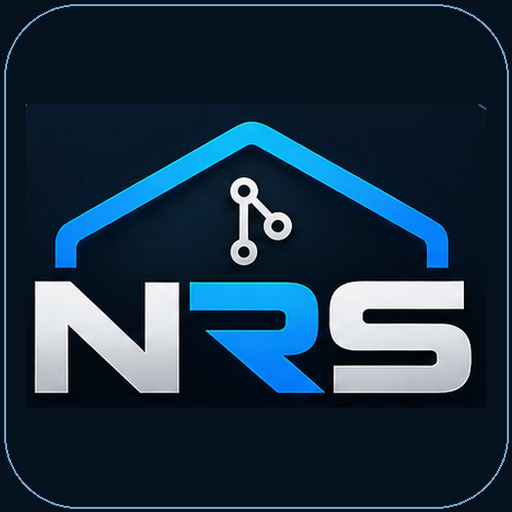

# NRS Workbench

<p align="center">
  
</p>

**Local developer control center for Git repositories and GitHub Actions self-hosted runners on Windows.**

> **Status:** v0.15.1 is the first **NRS Workbench** public-preview candidate. It keeps the audited runner/repository feature set from v0.14.3, adds the final public product identity and icon, and adopts the project's source-available noncommercial licensing model before the first public release.


## Public preview readiness

The public-preview gate combines a dependency-free Git smoke-test executable, source audit, Windows CI, tag-driven release automation, community templates, privacy/testing/architecture documentation and repository hardening. v0.15.1 adds no new Git write behavior.

Repository remotes are sanitized before display so embedded HTTP(S)/SSH user-info credentials are not exposed. Diff preview disables external diff and text-conversion helpers, untracked-file preview skips reparse points, and folder scanning does not follow junctions/symlinked directories.

Run the local readiness checks on Windows with:

```powershell
dotnet build .\NRSWorkbench.sln -c Release
dotnet run --project .\tests\NRS.Workbench.SmokeTests\NRS.Workbench.SmokeTests.csproj -c Release
.\scripts\public-audit.ps1
```

See `docs/TESTING.md`, `docs/PRIVACY.md`, `docs/ARCHITECTURE.md`, `docs/RELEASING.md` and `COMMERCIAL-LICENSING.md`.

## Goals

- Provide one local Windows control center for self-hosted runners and Git repositories.
- Keep runner control and repository management independent from mandatory GitHub API access.
- Discover local `actions-runner*` installations.
- Show trustworthy runner state (`READY`, `BUSY`, `STOPPED`, etc.).
- Start, stop and restart interactive runners and Windows-service runners.
- Inspect local runner metadata and `_diag` logs without exposing credentials.
- Show live BUSY-job progress from local worker diagnostics; numeric percentages are only shown when a comparable completed local execution exists.
- Summarize the locally retained execution history: total jobs, successes, failures, cancellations, unclassified runs, success rate, accumulated runtime and per-runner scope.
- Keep GitHub API integration optional.
- Store configuration in `%LOCALAPPDATA%\NRSWorkbench`.
- Keep the manager available from the Windows system tray with quick runner actions.
- Surface local operational health and optional desktop notifications for runner/job state changes.

## Architecture

- `NRS.Workbench.Core`: domain models and interfaces, no WPF dependency.
- `NRS.Workbench.App`: WPF UI and Windows-specific implementations.
- No third-party runtime packages.

## Local build

Requirements:

- Windows 10/11
- .NET 8 SDK

For a quick local test, run:

```text
RUN_ME_FIRST.cmd
```

The admin launch is useful when controlling runners installed as Windows services. Normal inspection should not require administrator rights.

## Windows tray and About

Version 0.10 adds a native Windows notification-area icon without external runtime packages. When enabled in **Configuración**, minimizing or closing the main window keeps NRS Workbench active in the tray. The tray menu exposes the current runner summary plus quick actions to reopen the UI, refresh state, start/stop all runners and exit explicitly.

The footer signature **Neo RS** opens the **Acerca de** window, which shows the running application version, .NET runtime, Windows version, local data path and PolyForm Noncommercial licensing information. These features are local only and do not add telemetry or account access.


## Operational health and notifications

Version 0.11 adds a compact **SALUD** signal to the main dashboard. It is deliberately operational rather than predictive: `OK` means every detected runner is either READY or BUSY, `ATENCIÓN` means at least one runner is stopped, and `ALERTA` means a runner is in ERROR or UNREGISTERED state. It does not reinterpret historical job failures as a machine-health failure.

Desktop notifications are optional and local. They can report READY → BUSY job starts, BUSY → READY job completion, and runner ERROR/UNREGISTERED transitions. By default notifications are only shown when none of NRS Workbench's windows is active, avoiding duplicate noise while the user is already watching the dashboard. Notification preferences are stored in `%LOCALAPPDATA%\NRSWorkbench\settings.json`.

The notification-area icon is also kept available while desktop notifications are enabled, even when close-to-tray behavior itself is disabled. No external push service, telemetry or account integration is used.


## Repositories module

Version 0.12 adds the first **Repositories** workspace. Repositories are added explicitly by selecting a Git working tree or by scanning a folder chosen by the user; the application does not crawl every disk automatically. The selected paths are persisted in the existing local settings file.

For each repository the UI reads local Git state through the `git` executable installed on Windows: branch, upstream, dirty-file count, ahead/behind divergence, `origin`, last commit and a compact state (`CLEAN`, `CAMBIOS`, `AHEAD`, `BEHIND`, `DIVERGED`, `CONFLICTO`, `SIN REMOTE`, `ERROR`).

The first quick actions are intentionally conservative:

- **Fetch** runs `git fetch --prune`.
- **Pull** runs `git pull --ff-only` and is only enabled for a clean working tree with a configured upstream and no local divergence.
- **Push** requires confirmation, requires local commits ahead of upstream and is blocked while the remote is ahead.

Version 0.13 adds a guarded **Commit** workflow. The user selects the files to include, reviews a local textual diff, enters the message, and confirms before Git is allowed to stage or commit anything. `Commit & Push` is only available when the branch has an upstream and the remote is not ahead.

Selective commits use `git add -A -- <selected paths>` and then create one normal Git commit. If Git already contains staged files outside the selected set, NRS Workbench blocks the operation rather than silently including them. Conflicts also block commits. Files with both staged and unstaged changes are explicitly warned because selecting that file stages its current complete content.

Branch switching and a higher-level Sync workflow remain deferred. NRS Workbench does not read or store Git credentials or GitHub tokens for these local operations; authentication remains the responsibility of the user's existing Git setup.

### NRS Workbench identity and migration

The public product and executable are **NRS Workbench** / `NRSWorkbench.exe`. Public .NET namespaces are `NRS.Workbench.*`. Local data is stored under `%LOCALAPPDATA%\NRSWorkbench`. On first launch, if the new settings file does not yet exist, NRS Workbench copies the legacy `%LOCALAPPDATA%\RunnerManager\settings.json` once so existing runner roots, repository paths and preferences are preserved. The legacy file is left untouched.

## Job progress

NRS Workbench does not fabricate a percentage. While a runner is BUSY it parses the local `_diag/Worker_*.log` stream and shows the current detected phase immediately. If previous completed worker logs contain a matching step sequence, the manager derives a local duration profile and displays an **estimated** percentage and remaining time.

If there is not enough comparable history yet, the progress bar stays indeterminate. After compatible executions complete, later runs can receive a numeric estimate automatically. Estimated progress also exposes a local confidence level based on the number of comparable runs. No GitHub API token is required for this local estimator.

NRS Workbench first prefers explicit step history. On runner builds that expose fewer step markers, it also recognises child-process activity such as PowerShell, Node.js, Git and .NET. If completed Worker logs exist but step matching is unavailable, a clearly labelled low-confidence runtime estimate may be calculated from median historical job duration; it is capped below completion while the runner remains BUSY.

## Local statistics

The **Estadísticas** view analyses the locally available `_diag/Worker_*.log` history for every detected runner. It provides all-time/local totals plus filters for today, the last 7 days and the last 30 days, a per-runner summary and a recent job history.

The unit is a **job processed by a runner**, not a GitHub workflow run. A workflow can contain multiple jobs. GitHub Runner diagnostic guidance treats `Worker_*.log` as the detailed per-job diagnostic stream, so NRS Workbench counts each parsed Worker log as one local job by default. It does **not** collapse records merely because names or timestamps look similar.

To protect against duplicated/copied diagnostics, v0.7.5 extracts stable identities when available (`Job ID`, `Plan ID`, `Request ID`, `Timeline ID`). A record is collapsed only when the same runner exposes the same stable identity with near-identical start times and no conflicting terminal result. The statistics window exposes the audit trail: Worker logs scanned, unique local jobs, duplicates discarded and jobs with a stable ID.

### Statistics dashboard

Version 0.9.0 adds runner reliability and 24-hour trend signals to the audited local activity dashboard. It shows the last 14 days of activity plus jobs today, jobs in the last 24 hours, jobs/day, first and last observed job, history coverage and the peak activity day. These metrics are derived only from the local `Worker_*.log` history available on the machine; they are not presented as a complete GitHub account history.

Results are intentionally conservative: NRS Workbench only marks a job as successful, failed or cancelled when a terminal job result is identifiable in the worker diagnostic log. Generic `ERR` lines are **not** treated as failed jobs because GitHub Runner diagnostics can contain recoverable transport or retry errors. Runs without a trustworthy terminal result remain **Sin clasificar** and are excluded from the success-rate denominator.

The statistics are the scope of the **locally retained diagnostic history**, not a guaranteed lifetime total from GitHub. No GitHub API token is needed. A future optional API integration can add workflow-run-level counts and reconcile the local history without replacing the offline statistics path.

On the first statistics load, NRS Workbench shows an `X/Y Worker logs` scan indicator and reads the retained history with a bounded parallel parser. Subsequent refreshes reuse the in-memory parsed-log cache when the underlying file has not changed.

## Security

NRS Workbench reads `.runner`, `.service` and `_diag` only for operational metadata. It intentionally does not read or display runner credential files.

## License

NRS Workbench is **source-available** under the **PolyForm Noncommercial License 1.0.0** (`PolyForm-Noncommercial-1.0.0`). The source may be used, studied, modified and distributed for noncommercial purposes as permitted by that license. Commercial use is not granted by the public license and requires separate written permission / a commercial license from **Neo RS**.

See `LICENSE` for the versioned license reference and required notice, and `COMMERCIAL-LICENSING.md` for the project's commercial-licensing policy.

Because the public license restricts commercial use, NRS Workbench is described as **source-available**, not OSI-approved open source.

## Disclaimer

This project is independent and is not affiliated with or endorsed by GitHub, Inc. GitHub and GitHub Actions are trademarks of GitHub, Inc.

## Local development note

`RUN_ME_FIRST.cmd` is intended for local test builds on Windows. It elevates once and, before compiling, closes only the current checkout's matching `NRSWorkbench.exe` process (and matching legacy `GitHubWorkspaceManager.exe` / `RunnerManager.exe` outputs during migration). This prevents the previous test instance from locking `NRS.Workbench.Core.dll` during rebuilds.


### Reliability and trend

The statistics dashboard distinguishes two different ideas:

- **Success rate** = OK / (OK + failed + cancelled). This describes the observed result mix.
- **Technical reliability** = OK / (OK + failed). Cancelled jobs are shown separately instead of being treated as technical failures.

The 24-hour trend compares technical reliability in the last 24 hours with the previous 24 hours. It is only shown when both windows contain at least three classified technical jobs.


## Autoría

Interfaz y dirección del proyecto: **Neo RS**. La aplicación muestra una firma discreta en el pie de sus vistas principales.
